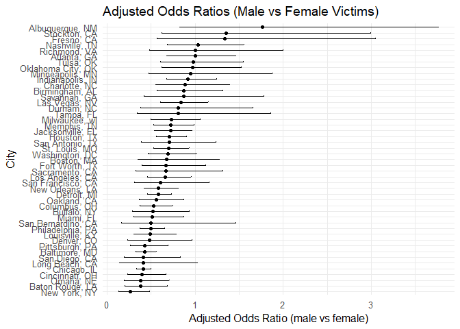
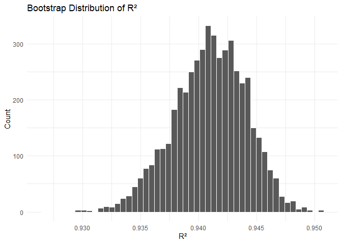
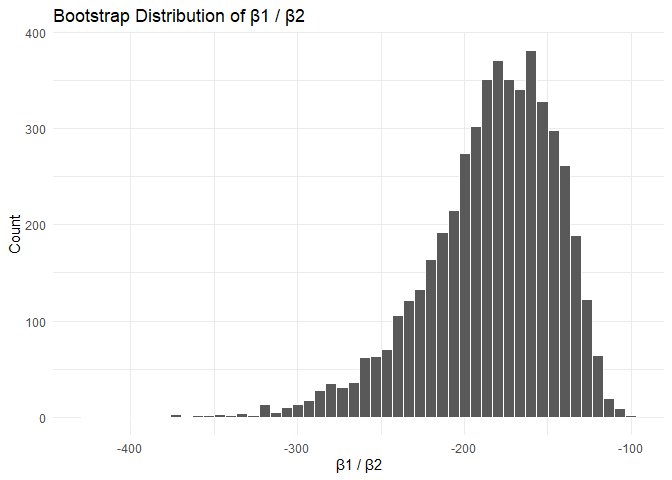

p8105_hw6_wl3013
================
Wen Li_wl3013
2025-11-29

### Question 1

``` r
# Import dataset
homicide_df <- read.csv("https://raw.githubusercontent.com/washingtonpost/data-homicides/refs/heads/master/homicide-data.csv")

# Clean data
clean_df <- homicide_df |> 
  mutate(
    city_state = str_c(city, state, sep = ", "),
    solved = if_else(disposition == "Closed by arrest", 1, 0),
    victim_age = as.numeric(victim_age)
  ) |> 
  # drop problematic cities
  filter(!city_state %in% c("Dallas, TX", "Phoenix, AZ", 
                            "Kansas City, MO", "Tulsa, AL")) |> 
  # keep only white / black victims
  filter(victim_race %in% c("White", "Black")) |> 
  drop_na(victim_age, victim_sex, victim_race)
```

    ## Warning: There was 1 warning in `mutate()`.
    ## ℹ In argument: `victim_age = as.numeric(victim_age)`.
    ## Caused by warning:
    ## ! NAs introduced by coercion

``` r
# Fit logistic regression for Baltimore, MD
baltimore_df <- clean_df |> 
  filter(city_state == "Baltimore, MD")

baltimore_fit <- glm(
  solved ~ victim_age + victim_sex + victim_race,
  data = baltimore_df,
  family = binomial()
)

# Baltimore: extract OR + CI for male vs female
baltimore_or <- baltimore_fit |> 
  broom::tidy(conf.int=T) |> 
  filter(term == "victim_sexMale") |> 
  mutate(
    OR = exp(estimate),
    CI_low = exp(conf.low),
    CI_high = exp(conf.high)) |> 
  select(term, log_OR = estimate, OR, CI_low, CI_high, p.value) |> 
  knitr::kable(digits = 3)

baltimore_or
```

| term           | log_OR |    OR | CI_low | CI_high | p.value |
|:---------------|-------:|------:|-------:|--------:|--------:|
| victim_sexMale | -0.854 | 0.426 |  0.324 |   0.558 |       0 |

``` r
# Run glm and extract OR + CI for other cities
# Write a function for running glm and extract OR + CI
fit_city_glm <- function(df) {
  glm(
    solved ~ victim_age + victim_sex + victim_race,
    data = df,
    family = binomial()
  ) |>
    broom::tidy(conf.int = TRUE, exponentiate = TRUE) |>
    filter(term == "victim_sexMale") |>
    select(term, estimate, conf.low, conf.high)
}

# Run function for each cities
city_or_df <- clean_df |>
  nest(data = -city_state) |>
  mutate(results = map(data, fit_city_glm)) |>
  unnest(results)
```

    ## Warning: There were 43 warnings in `mutate()`.
    ## The first warning was:
    ## ℹ In argument: `results = map(data, fit_city_glm)`.
    ## Caused by warning:
    ## ! glm.fit: fitted probabilities numerically 0 or 1 occurred
    ## ℹ Run `dplyr::last_dplyr_warnings()` to see the 42 remaining warnings.

``` r
# Create a plot comparing the OR and CI
city_or_plot_df <- city_or_df |>
  arrange(estimate) |>
  mutate(city_state = fct_inorder(city_state))

ggplot(city_or_plot_df, aes(x = city_state, y = estimate)) +
  geom_point() +
  geom_errorbar(aes(ymin = conf.low, ymax = conf.high), width = 0.2) +
  coord_flip() +
  labs(
    title = "Adjusted Odds Ratios (Male vs Female Victims)",
    x = "City",
    y = "Adjusted Odds Ratio (male vs female)"
  ) +
  theme_minimal(base_size = 12)
```

<!-- -->

Cities vary widely in the adjusted odds of a homicide being solved for
male vs female victims. Most cities have odds ratios close to 1,
indicating little difference in clearance likelihood by victim gender
after adjusting for age and race. However, a few cities show large OR
with wide confidence intervals, suggesting unstable estimates driven by
small sample sizes or separation issues in the data. Also, several
cities have OR below 1, implying that homicides of male victims may be
less likely to be solved compared with female victims, while others show
the opposite pattern.

### Question 2

``` r
data("weather_df")
set.seed(1)

# Define linar model and return R^2 and beta1/beta2
boot_fn <- function(df) {
  fit <- lm(tmax ~ tmin + prcp, data = df)
  # extract r2
  r2 <- broom::glance(fit)$r.squared
  # extract betas
  coefs <- broom::tidy(fit)
  beta1 <- coefs$estimate[coefs$term == "tmin"]
  beta2 <- coefs$estimate[coefs$term == "prcp"]
  ratio <- beta1 / beta2
  tibble(
    r2 = r2,
    ratio = ratio
  )
}
  
# Run the function
boot_results <-
  replicate(
    5000,
    boot_fn(weather_df |> slice_sample(n = nrow(weather_df), replace = TRUE)),
    simplify = FALSE
  ) |>
  bind_rows()

head(boot_results)
```

    ## # A tibble: 6 × 2
    ##      r2 ratio
    ##   <dbl> <dbl>
    ## 1 0.941 -202.
    ## 2 0.940 -222.
    ## 3 0.944 -166.
    ## 4 0.941 -228.
    ## 5 0.944 -149.
    ## 6 0.938 -172.

``` r
# Plots distribution
# R^2 distribution
boot_results |>
  ggplot(aes(x = r2)) +
  geom_histogram(bins = 50, color = "white") +
  labs(
    title = "Bootstrap Distribution of R²",
    x = "R²",
    y = "Count"
  ) +
  theme_minimal()
```

<!-- -->

The bootstrap distribution of R square is roughly normal distribution,
with the center around 0.94. This suggests that the fitted model
consistently explains about 94% of the variation in `tmax` across
bootstrap samples. The spread of the distribution is narrow, suggesting
that the model’s explanatory power is stable and shows little variation
under resampling. Also, most bootstrap R² values fall between roughly
0.935 and 0.945.

``` r
# beta1 / beta2 distribution
boot_results |>
  ggplot(aes(x = ratio)) +
  geom_histogram(bins = 50, color = "white") +
  labs(
    title = "Bootstrap Distribution of β1 / β2",
    x = "β1 / β2",
    y = "Count"
  ) +
  theme_minimal()
```

<!-- -->

The bootstrap distribution of ratio (β1/β2) has a left-skewed
distribution, with the center around -170. This indicates that the ratio
of the temperature effect (`tmin`) to the precipitation effect (`prcp`)
is consistently negative and large in magnitude across bootstrap
samples. The long left tail reflects occasional resamples in which the
estimated precipitation coefficient is very close to zero, producing
more extreme negative ratios. Overall, the distribution shows
substantial variability but a clear concentration around a moderately
large negative value.

``` r
# 95% CI
# R^2 CI
boot_ci_r2 <- quantile(boot_results$r2, c(0.025, 0.975))
boot_ci_r2
```

    ##      2.5%     97.5% 
    ## 0.9343767 0.9466277

``` r
# beta1/beta2 CI
boot_ci_ratio <- quantile(boot_results$ratio, c(0.025, 0.975))
boot_ci_ratio
```

    ##      2.5%     97.5% 
    ## -279.7489 -125.6859

The 95% CI for R square is (0.9344, 0.9466). The 95% CI for ratio
(β1/β2) is (-279.7489, -125.6859).
