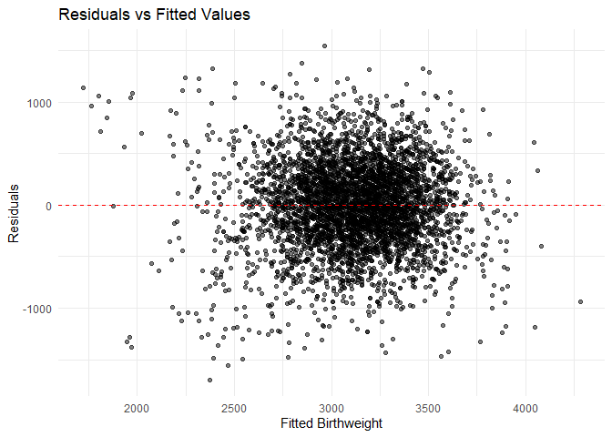

p8105_hw6_wl3013
================
Wen Li_wl3013
2025-11-29

### Question 1

``` r
# Import dataset
homicide_df <- read.csv("https://raw.githubusercontent.com/washingtonpost/data-homicides/refs/heads/master/homicide-data.csv")

# Clean data
clean_df <- homicide_df |> 
  mutate(
    city_state = str_c(city, state, sep = ", "),
    solved = if_else(disposition == "Closed by arrest", 1, 0),
    victim_age = as.numeric(victim_age)
  ) |> 
  # drop problematic cities
  filter(!city_state %in% c("Dallas, TX", "Phoenix, AZ", 
                            "Kansas City, MO", "Tulsa, AL")) |> 
  # keep only white / black victims
  filter(victim_race %in% c("White", "Black")) |> 
  drop_na(victim_age, victim_sex, victim_race)
```

    ## Warning: There was 1 warning in `mutate()`.
    ## ℹ In argument: `victim_age = as.numeric(victim_age)`.
    ## Caused by warning:
    ## ! NAs introduced by coercion

``` r
# Fit logistic regression for Baltimore, MD
baltimore_df <- clean_df |> 
  filter(city_state == "Baltimore, MD")

baltimore_fit <- glm(
  solved ~ victim_age + victim_sex + victim_race,
  data = baltimore_df,
  family = binomial()
)

# Baltimore: extract OR + CI for male vs female
baltimore_or <- baltimore_fit |> 
  broom::tidy(conf.int=T) |> 
  filter(term == "victim_sexMale") |> 
  mutate(
    OR = exp(estimate),
    CI_low = exp(conf.low),
    CI_high = exp(conf.high)) |> 
  select(term, log_OR = estimate, OR, CI_low, CI_high, p.value) |> 
  knitr::kable(digits = 3)

baltimore_or
```

| term           | log_OR |    OR | CI_low | CI_high | p.value |
|:---------------|-------:|------:|-------:|--------:|--------:|
| victim_sexMale | -0.854 | 0.426 |  0.324 |   0.558 |       0 |

``` r
# Run glm and extract OR + CI for other cities
# Write a function for running glm and extract OR + CI
fit_city_glm <- function(df) {
  glm(
    solved ~ victim_age + victim_sex + victim_race,
    data = df,
    family = binomial()
  ) |>
    broom::tidy(conf.int = TRUE, exponentiate = TRUE) |>
    filter(term == "victim_sexMale") |>
    select(term, estimate, conf.low, conf.high)
}

# Run function for each cities
city_or_df <- clean_df |>
  nest(data = -city_state) |>
  mutate(results = map(data, fit_city_glm)) |>
  unnest(results)
```

    ## Warning: There were 43 warnings in `mutate()`.
    ## The first warning was:
    ## ℹ In argument: `results = map(data, fit_city_glm)`.
    ## Caused by warning:
    ## ! glm.fit: fitted probabilities numerically 0 or 1 occurred
    ## ℹ Run `dplyr::last_dplyr_warnings()` to see the 42 remaining warnings.

``` r
# Create a plot comparing the OR and CI
city_or_plot_df <- city_or_df |>
  arrange(estimate) |>
  mutate(city_state = fct_inorder(city_state))

ggplot(city_or_plot_df, aes(x = city_state, y = estimate)) +
  geom_point() +
  geom_errorbar(aes(ymin = conf.low, ymax = conf.high), width = 0.2) +
  coord_flip() +
  labs(
    title = "Adjusted Odds Ratios (Male vs Female Victims)",
    x = "City",
    y = "Adjusted Odds Ratio (male vs female)"
  ) +
  theme_minimal(base_size = 12)
```

<!-- -->

Cities vary widely in the adjusted odds of a homicide being solved for
male vs female victims. Most cities have odds ratios close to 1,
indicating little difference in clearance likelihood by victim gender
after adjusting for age and race. However, a few cities show large OR
with wide confidence intervals, suggesting unstable estimates driven by
small sample sizes or separation issues in the data. Also, several
cities have OR below 1, implying that homicides of male victims may be
less likely to be solved compared with female victims, while others show
the opposite pattern.

### Question 2

``` r
data("weather_df")
set.seed(1)

# Define linar model and return R^2 and beta1/beta2
boot_fn <- function(df) {
  fit <- lm(tmax ~ tmin + prcp, data = df)
  # extract r2
  r2 <- broom::glance(fit)$r.squared
  # extract betas
  coefs <- broom::tidy(fit)
  beta1 <- coefs$estimate[coefs$term == "tmin"]
  beta2 <- coefs$estimate[coefs$term == "prcp"]
  ratio <- beta1 / beta2
  tibble(
    r2 = r2,
    ratio = ratio
  )
}
  
# Run the function
boot_results <-
  replicate(
    5000,
    boot_fn(weather_df |> slice_sample(n = nrow(weather_df), replace = TRUE)),
    simplify = FALSE
  ) |>
  bind_rows()

head(boot_results)
```

    ## # A tibble: 6 × 2
    ##      r2 ratio
    ##   <dbl> <dbl>
    ## 1 0.941 -202.
    ## 2 0.940 -222.
    ## 3 0.944 -166.
    ## 4 0.941 -228.
    ## 5 0.944 -149.
    ## 6 0.938 -172.

``` r
# Plots distribution
# R^2 distribution
boot_results |>
  ggplot(aes(x = r2)) +
  geom_histogram(bins = 50, color = "white") +
  labs(
    title = "Bootstrap Distribution of R²",
    x = "R²",
    y = "Count"
  ) +
  theme_minimal()
```

<!-- -->

The bootstrap distribution of R square is roughly normal distribution,
with the center around 0.94. This suggests that the fitted model
consistently explains about 94% of the variation in `tmax` across
bootstrap samples. The spread of the distribution is narrow, suggesting
that the model’s explanatory power is stable and shows little variation
under resampling. Also, most bootstrap R² values fall between roughly
0.935 and 0.945.

``` r
# beta1 / beta2 distribution
boot_results |>
  ggplot(aes(x = ratio)) +
  geom_histogram(bins = 50, color = "white") +
  labs(
    title = "Bootstrap Distribution of β1 / β2",
    x = "β1 / β2",
    y = "Count"
  ) +
  theme_minimal()
```

<!-- -->

The bootstrap distribution of ratio (β1/β2) has a left-skewed
distribution, with the center around -170. This indicates that the ratio
of the temperature effect (`tmin`) to the precipitation effect (`prcp`)
is consistently negative and large in magnitude across bootstrap
samples. The long left tail reflects occasional resamples in which the
estimated precipitation coefficient is very close to zero, producing
more extreme negative ratios. Overall, the distribution shows
substantial variability but a clear concentration around a moderately
large negative value.

``` r
# 95% CI
# R^2 CI
boot_ci_r2 <- quantile(boot_results$r2, c(0.025, 0.975))

# beta1/beta2 CI
boot_ci_ratio <- quantile(boot_results$ratio, c(0.025, 0.975))
```

Using the 2.5% and 97.5% quantile, the 95% CI for R square is (0.934,
0.947), and the 95% CI for ratio (β1/β2) is (-279.749, -125.686).

### Question 3

``` r
# Import and clean data
birth_df <- 
  read_csv("data/birthweight.csv") |>
  mutate(
    babysex = factor(babysex, levels = c(1, 2), labels = c("male", "female")),
    frace = factor(frace),
    mrace = factor(mrace),
    malform = factor(malform, levels = c(0, 1), labels = c("absent", "present"))
  ) |>
  drop_na()
```

    ## Rows: 4342 Columns: 20
    ## ── Column specification ────────────────────────────────────────────────────────
    ## Delimiter: ","
    ## dbl (20): babysex, bhead, blength, bwt, delwt, fincome, frace, gaweeks, malf...
    ## 
    ## ℹ Use `spec()` to retrieve the full column specification for this data.
    ## ℹ Specify the column types or set `show_col_types = FALSE` to quiet this message.

``` r
# Model A: proposed model
bw_model <- lm(
  bwt ~ gaweeks + ppwt + wtgain + babysex + mrace + fincome + smoken,
  data = birth_df
)
summary(bw_model)
```

    ## 
    ## Call:
    ## lm(formula = bwt ~ gaweeks + ppwt + wtgain + babysex + mrace + 
    ##     fincome + smoken, data = birth_df)
    ## 
    ## Residuals:
    ##      Min       1Q   Median       3Q      Max 
    ## -1694.79  -253.28     6.83   270.87  1541.33 
    ## 
    ## Coefficients:
    ##                Estimate Std. Error t value Pr(>|t|)    
    ## (Intercept)    423.4024    91.0255   4.651 3.39e-06 ***
    ## gaweeks         52.9532     2.0941  25.286  < 2e-16 ***
    ## ppwt             4.7848     0.3224  14.840  < 2e-16 ***
    ## wtgain           9.9141     0.5942  16.685  < 2e-16 ***
    ## babysexfemale  -86.0755    12.8218  -6.713 2.15e-11 ***
    ## mrace2        -285.1283    15.0375 -18.961  < 2e-16 ***
    ## mrace3         -79.3944    65.4541  -1.213    0.225    
    ## mrace4        -133.2372    29.2637  -4.553 5.43e-06 ***
    ## fincome          0.4052     0.2691   1.506    0.132    
    ## smoken         -11.8065     0.8945 -13.199  < 2e-16 ***
    ## ---
    ## Signif. codes:  0 '***' 0.001 '**' 0.01 '*' 0.05 '.' 0.1 ' ' 1
    ## 
    ## Residual standard error: 421.3 on 4332 degrees of freedom
    ## Multiple R-squared:  0.3248, Adjusted R-squared:  0.3234 
    ## F-statistic: 231.5 on 9 and 4332 DF,  p-value: < 2.2e-16

This model includes demographic and behavioral predictors to capture
mother’s characteristics. Using `gaweeks` (gestational age in weeks),
`ppwt` (mother’s pre-pregnancy weight), `wtgain` (mother’s weight gain
during pregnancy) to describe mother’s change in pregnancy, and using
`mrace`, `fincome` (family monthly income), `smoken` (average number of
cigarettes smoked per day during pregnancy) as baseline characteristics.
All these predictors may effect the birthweight during pregnancy.
Besides, considering the collinearity problem, the model avoid using
closely related variables like `ppwt` and `ppbmi`.

``` r
# Plot model residuals
birth_df_with_preds <- 
  birth_df |>
  add_predictions(bw_model) |>
  add_residuals(bw_model)

birth_df_with_preds |>
  ggplot(aes(x = pred, y = resid)) +
  geom_point(alpha = 0.5) +
  geom_hline(yintercept = 0, color = "red", linetype = "dashed") +
  labs(
    title = "Residuals vs Fitted Values",
    x = "Fitted Birthweight",
    y = "Residuals"
  ) +
  theme_minimal()
```

<!-- -->

The plot shows no strong nonlinear pattern, suggesting that the
linearity assumption is reasonable. The points are generally centered
around zero across the range of fitted values, indicating no obvious
systematic bias. However, the spread of the residuals increases slightly
at both lower and higher fitted birthweights, suggesting mild
heteroscedasticity. A few extreme residuals (both high and low) are
visible, but overall the residuals appear roughly symmetric and fairly
well-behaved for a linear regression model.

``` r
# Model A: proposed model
model_A <- lm(
  bwt ~ gaweeks + ppwt + wtgain + babysex + mrace + fincome + smoken,
  data = birth_df
)

# Model B: length + gestational age
model_B_formula <- bwt ~ blength + gaweeks

# Model C: head circumference, length, sex + ALL interactions
model_C_formula <- bwt ~ bhead * blength * babysex

# Build cross-validation splits
set.seed(1)
cv_df <- crossv_mc(birth_df, n = 100)

# Fit 3 models
cv_df <- cv_df |>
  mutate(
    train = map(train, as.data.frame),
    test  = map(test,  as.data.frame),

    # Fit models
    fit_A = map(train, ~ lm(
      bwt ~ gaweeks + ppwt + wtgain + babysex + mrace + fincome + smoken,
      data = .x
    )),
    fit_B = map(train, ~ lm(model_B_formula, data = .x)),
    fit_C = map(train, ~ lm(model_C_formula, data = .x))
  )

# Compute prediction error (RMSE) on test sets
cv_df <- cv_df |>
  mutate(
    rmse_A = map2_dbl(fit_A, test, ~ rmse(model = .x, data = .y)),
    rmse_B = map2_dbl(fit_B, test, ~ rmse(model = .x, data = .y)),
    rmse_C = map2_dbl(fit_C, test, ~ rmse(model = .x, data = .y))
  )

# Summary and compare models
cv_results <- cv_df |>
  summarise(
    rmse_A = mean(rmse_A),
    rmse_B = mean(rmse_B),
    rmse_C = mean(rmse_C)
  )

cv_results
```

    ## # A tibble: 1 × 3
    ##   rmse_A rmse_B rmse_C
    ##    <dbl>  <dbl>  <dbl>
    ## 1   423.   332.   289.

Based on the result of cross-validation, Model C achieved the lowest
average RMSE (289 g), followed by Model B (332 g) and Model A (423 g).
This indicates that the interaction model using head circumference,
length, and baby gender provides the best predictive performance. The
model with only length and gestational age also performs well. However,
the proposed model shows the largest prediction error.
